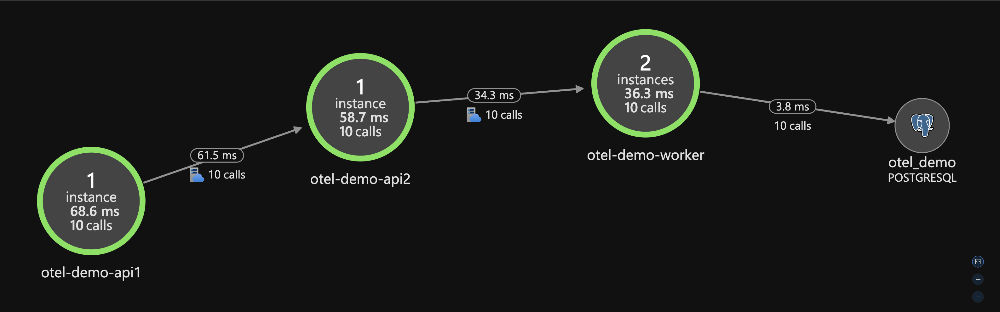

# OTEL Demo



## Create Azure Resources

```bash
terraform -chdir=infra init
```

```bash
terraform -chdir=infra apply
```

## Setup Environment Variables

```bash
./setup_env.sh
```

## Start Services

### Auto-Instrumentation

```bash
docker compose -f docker-compose.auto.yml up --build -d
```

### Manual Instrumentation

```bash
docker compose -f docker-compose.manual.yml up --build -d
```

## Make Requests

```bash
curl -i -X POST http://localhost:8080/rolldice/demo-player
```

## Stop Services

### Auto-Instrumentation

```bash
docker compose -f docker-compose.auto.yml down -v
```

### Manual Instrumentation

```bash
docker compose -f docker-compose.manual.yml down -v
```

## Destroy Azure Resources

```bash
terraform -chdir=infra destroy
```
